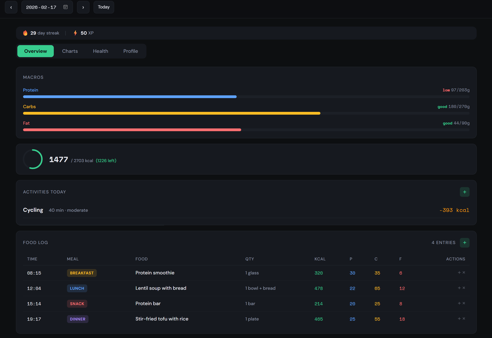
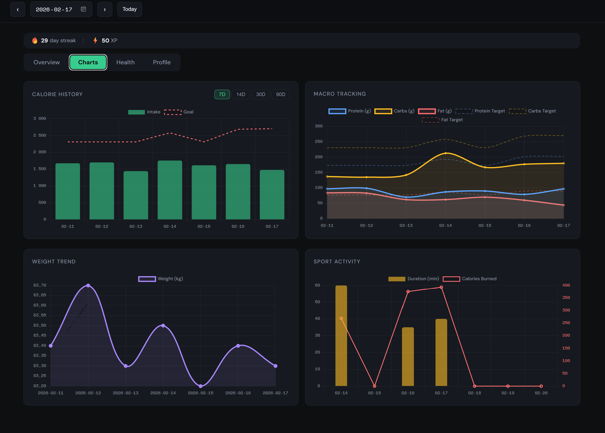
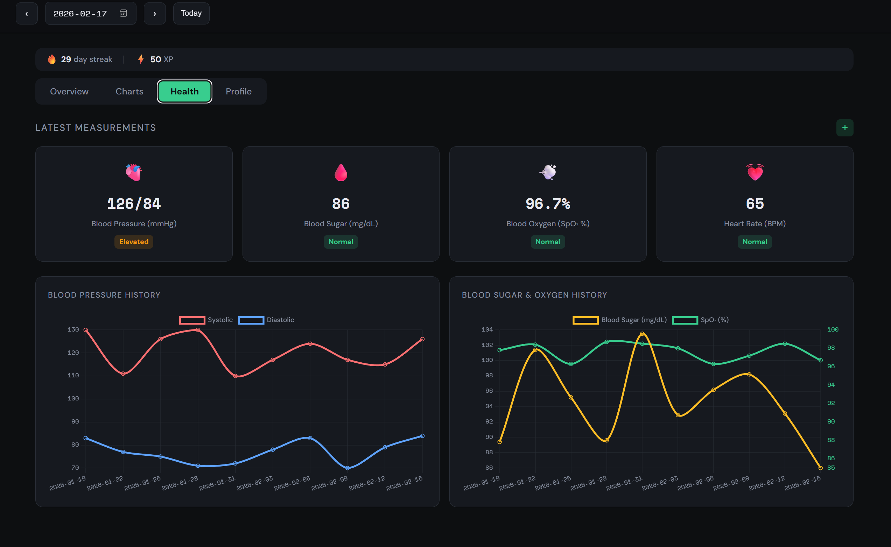

# NutriTrack

**AI-powered personal nutrition and health tracking platform**

---

## What Is NutriTrack

NutriTrack is a self-hosted nutrition and health tracking application designed to work hand-in-hand with AI agents. You talk to your AI assistant, it logs your meals, exercise, weight, and vitals through NutriTrack's REST API, and a real-time dashboard visualizes everything. A built-in gamification system awards XP, tracks streaks, and grants badges to keep you motivated. NutriTrack is LLM-agnostic -- any agent that can make HTTP calls can serve as your personal nutrition assistant.

The platform runs locally on the user's machine -- no cloud accounts or external services required. Users can optionally expose it via reverse proxy or tunnels if they want remote access, but this is entirely optional -- the default is localhost-only.

## Screenshots

| Overview | Charts | Health |
|----------|--------|--------|
|  |  |  |

## Features

- Calorie and macro tracking with personalized daily goals calculated using the Mifflin-St Jeor equation
- Weight trend tracking with historical charts
- Exercise logging with dynamic calorie adjustment (exercise calories feed back into your daily budget)
- Health vitals monitoring: blood pressure, blood sugar, SpO2, and heart rate
- Gamification system with streaks, XP points, elite status, and achievement badges
- Dark-theme dashboard built with Chart.js for all visualizations
- REST API with auto-generated Swagger documentation at `/docs`
- AI agent integration -- any LLM can log and query data via standard HTTP requests
- Zero-configuration SQLite database (no external database server required)
- Docker and bare-metal deployment options
- AI Coaching — Real-time post-meal tips + weekly health reports from your AI agent
- Food search across past entries and CSV data export

## Installation

### 🤖 Option A: Let Your AI Agent Install It — *Easiest, Zero Human Effort*

**You don't touch the terminal. Your AI bot does everything.**

Just tell your [OpenClaw](https://docs.openclaw.ai) agent:

> **"Install this skill: https://raw.githubusercontent.com/BenZenTuna/Nutritrack/main/SKILL.md"**

Then:

> **"Deploy NutriTrack"**

Done. Your agent clones the repo, runs the deploy script, starts the server, and verifies it's healthy. You never open a terminal, install dependencies, or make a single decision.

Next, set up your profile by telling your agent:

> **"Set up my NutriTrack profile. I'm 30 years old, male, 180cm tall, 85kg, moderately active, and my goal weight is 78kg."**

Now start tracking — just talk naturally:

| You say | Your agent does |
|---------|----------------|
| *"I had oatmeal with banana for breakfast"* | Estimates ~350 kcal, 12g protein, 58g carbs, 8g fat → logs it |
| *"I went for a 30 minute run"* | Calculates ~340 kcal burned using your weight → logs it |
| *"I weigh 84.2 kg this morning"* | Logs weight, updates your profile, recalculates daily targets |
| *"How am I doing today?"* | Shows your calorie/macro intake vs goals, remaining budget |
| *"How was my week?"* | Gives you a 7-day nutrition, exercise, and weight summary |
| *"My blood pressure is 118/76"* | Logs health vitals |

Your dashboard is always available at **http://localhost:8000** to see charts, trends, streaks, and gamification badges.

<details>
<summary>Alternative skill install methods</summary>

**One-liner terminal command:**
```bash
curl -sL https://raw.githubusercontent.com/BenZenTuna/Nutritrack/main/remote-install.sh | bash
openclaw gateway restart
```

**From cloned repo:**
```bash
cd Nutritrack
chmod +x install.sh
./install.sh
openclaw gateway restart
```
</details>

### 🛠 Option B: Manual Deploy Script

If you prefer to install it yourself, or don't have an OpenClaw agent:

```bash
git clone https://github.com/BenZenTuna/Nutritrack.git
cd Nutritrack
chmod +x deploy.sh
./deploy.sh
```

Open [http://localhost:8000](http://localhost:8000). The script auto-detects Docker or Python and handles everything — no prompts, no decisions.

<details>
<summary>Other manual methods (Docker / direct install)</summary>

**Docker:**
```bash
git clone https://github.com/BenZenTuna/Nutritrack.git
cd Nutritrack
docker compose up -d
```

**Direct install:**
```bash
git clone https://github.com/BenZenTuna/Nutritrack.git
cd Nutritrack
chmod +x install.sh
./install.sh
```

The installer checks for Python 3.10+, creates a virtual environment, installs dependencies, initializes the database, and starts the server.

</details>

## Management

```bash
./deploy.sh          # Start or restart
./deploy.sh stop     # Stop the server
./deploy.sh status   # Check if running
./deploy.sh update   # Pull latest + restart
```

Set `NUTRITRACK_PORT=9000 ./deploy.sh` to use a custom port.

## What Happens Behind the Scenes

Here's the full chain when your AI agent installs NutriTrack from one URL:

```
You: "Install this skill: https://raw.githubusercontent.com/..."
 │
 ├─ Agent downloads SKILL.md (one small file via curl)
 │
 ├─ SKILL.md contains EVERYTHING the agent needs:
 │   ├── GitHub repo URL + deploy commands
 │   ├── Full API reference (every endpoint, every field)
 │   ├── Calorie & macro estimation tables
 │   ├── Exercise MET formula + values
 │   ├── Gamification rules (streaks, points, badges)
 │   └── Agent behavior rules
 │
 ├─ You: "Deploy NutriTrack"
 │   └─ Agent: git clone → ./deploy.sh → server running ✓
 │
 ├─ You: "Set up my profile..."
 │   └─ Agent: PUT /api/profile → daily targets calculated ✓
 │
 └─ You: "I had pizza for dinner"
     └─ Agent: estimates macros → POST /api/food → logged ✓
         └─ Dashboard updates automatically every 30 seconds
```

The agent never needs web search. Everything it needs is in that one skill file on disk.

## Your Data is Safe

- Your nutrition database is stored locally on your machine
- `git pull` and updates will **never** delete your data
- No cloud accounts, no external services, no data leaves your machine
- Only you (and your agent) can access it

## Load Demo Data

Seed 30 days of realistic sample data to explore the dashboard immediately.

**Docker:**

```bash
docker compose exec nutritrack python3 seed.py
```

**Direct install:**

```bash
python3 seed.py
```

## API Reference

All endpoints are served under `http://localhost:8000`. Interactive Swagger documentation is available at `/docs`.

### Profile

| Method | Endpoint | Description |
|--------|----------|-------------|
| GET | `/api/profile` | Get the current user profile |
| PUT | `/api/profile` | Create or update the user profile |

### Food

| Method | Endpoint | Description |
|--------|----------|-------------|
| POST | `/api/food` | Log a food entry |
| GET | `/api/food` | Get food entries for a date (default: today) |
| GET | `/api/food/range` | Get food entries for a date range |
| GET | `/api/food/search` | Search past food entries by name |
| PUT | `/api/food/{id}` | Update a food entry |
| DELETE | `/api/food/{id}` | Delete a food entry |

### Weight

| Method | Endpoint | Description |
|--------|----------|-------------|
| POST | `/api/weight` | Log a weight measurement |
| GET | `/api/weight` | Get weight history |

### Activity

| Method | Endpoint | Description |
|--------|----------|-------------|
| POST | `/api/activity` | Log an exercise activity |
| GET | `/api/activity` | Get activities for a date (default: today) |
| GET | `/api/activity/range` | Get activities for a date range |
| PUT | `/api/activity/{id}` | Update an activity entry |
| DELETE | `/api/activity/{id}` | Delete an activity entry |

### Health

| Method | Endpoint | Description |
|--------|----------|-------------|
| POST | `/api/health` | Log a health measurement |
| GET | `/api/health` | Get health measurement history |
| PUT | `/api/health/{id}` | Update a health measurement |
| DELETE | `/api/health/{id}` | Delete a health measurement |

### Reports

| Method | Endpoint | Description |
|--------|----------|-------------|
| GET | `/api/daily-summary` | Get full daily summary with goals and intake |
| GET | `/api/weekly-report` | Get a 7-day aggregated report |
| GET | `/api/history/daily-totals` | Get daily calorie/macro totals for charting |

### Gamification

| Method | Endpoint | Description |
|--------|----------|-------------|
| GET | `/api/gamification` | Get current streak, XP, and elite status |

### Export

| Method | Endpoint | Description |
|--------|----------|-------------|
| GET | `/api/export/csv` | Export food, weight, activity, or health data as CSV |

### Seed

| Method | Endpoint | Description |
|--------|----------|-------------|
| POST | `/api/seed-demo-data` | Populate the database with 30 days of demo data |

### Coaching

| Method | Endpoint | Description |
|--------|----------|-------------|
| PUT | `/api/coaching/daily` | Update today's post-meal coaching tip |
| GET | `/api/coaching/daily` | Get coaching tip for a date |
| POST | `/api/coaching/report` | Save a weekly coaching report |
| GET | `/api/coaching/reports` | List all weekly reports |
| GET | `/api/coaching/reports/latest` | Get most recent weekly report |
| DELETE | `/api/coaching/reports/{id}` | Delete a weekly report |

## AI Coaching System

NutriTrack includes a two-tier AI coaching system that turns your agent into a personal health coach:

### Daily Post-Meal Coaching

After every meal you log, your AI agent analyzes your current nutrition status and writes a short coaching tip that appears on your dashboard. The collapsible panel below the macro bars shows:

- **One-line priority** — the single most important thing to focus on for the rest of the day
- **Protein status badge** — instant visual of whether you're on track, low, or critical
- **Expanded view** — click to read the full coaching analysis with specific meal suggestions

The agent updates this automatically every time it logs food via `POST /api/food`, followed by `PUT /api/coaching/daily`.

### Weekly Health Reports

Every Sunday (or on demand), your agent writes a comprehensive weekly review that appears in the dashboard's **Coaching tab**:

- Calorie compliance analysis with specific days highlighted
- Weight trend evaluation (too fast / healthy / too slow)
- Food quality spotlight naming specific meals
- Activity summary
- Letter grade (A+ through F)
- 3 concrete action items for next week

Reports are saved via `POST /api/coaching/report` and displayed with summary stat cards and formatted sections.

## Configuration

NutriTrack is configured through environment variables. For Docker deployments, set these in a `.env` file or in your `docker-compose.yml`. For direct installs, export them before running the server.

| Variable | Default | Description |
|----------|---------|-------------|
| `NUTRITRACK_DB_PATH` | `nutritrack.db` | Path to the SQLite database file |
| `NUTRITRACK_HOST` | `0.0.0.0` | Server bind address |
| `NUTRITRACK_PORT` | `8000` | Server port |
| `NUTRITRACK_CORS_ORIGINS` | `*` | CORS allowed origins (comma-separated or `*` for all) |
| `SEED_DEMO_DATA` | `false` | Auto-seed demo data on first startup when the database is empty |
| `TZ` | `UTC` | Timezone for the container |

## Architecture

```
User <---> AI Agent <---> NutriTrack Server (FastAPI) <---> SQLite
                                  |
                           Web Dashboard
```

The user interacts with an AI agent in natural language. The agent translates those conversations into HTTP API calls to the NutriTrack FastAPI server. The server persists all data in a local SQLite database. The web dashboard reads from the same API endpoints to render charts and summaries in the browser.

## Tech Stack

- **FastAPI** -- async Python web framework serving the REST API and Swagger docs
- **SQLite** -- embedded database with WAL mode for concurrent reads
- **Vanilla JS** -- zero-dependency frontend, no build step required
- **Chart.js** -- interactive charts for calories, macros, weight trends, and health vitals

## Contributing

1. Fork the repository
2. Create a feature branch (`git checkout -b feature/your-feature`)
3. Commit your changes (`git commit -m "Add your feature"`)
4. Push to the branch (`git push origin feature/your-feature`)
5. Open a Pull Request

## License

This project is licensed under the MIT License. See the [LICENSE](LICENSE) file for details.
